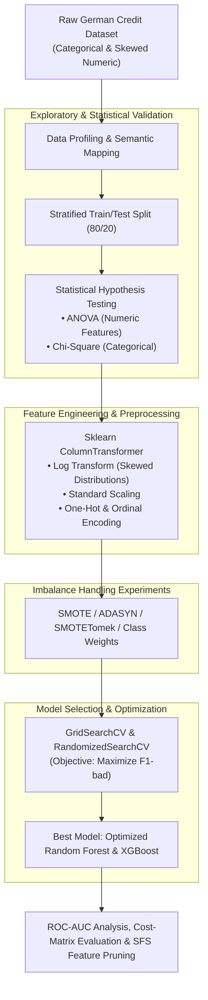

# CreditRisk Sentinel: Machine Learning Classification Benchmark on Imbalanced Financial Data

[](https://www.python.org/)
[](https://scikit-learn.org/)
[](https://xgboost.readthedocs.io/)
[](https://imbalanced-learn.org/)
[](LICENSE)

> An end-to-end Machine Learning benchmark designed to predict credit default risk on highly imbalanced tabular financial data, prioritizing minority-class detection quality (`bad` credit) rather than deceptive accuracy metrics.

---

## 📖 Overview & Problem Statement

In credit scoring, predicting default (`bad` credit) is an asymmetric decision problem: classifying a defaulting borrower as non-defaulting is vastly more expensive than the inverse mistake. Because default events are inherently rare, naive models achieve high overall accuracy simply by predicting the majority class (`good`), failing in real-world credit risk assessment.

**CreditRisk Sentinel** implements a rigorous data science pipeline comparing **7 classification algorithm families**, combining statistical exploratory analysis (ANOVA, Chi-square), modern resampling strategies (**SMOTE, ADASYN, SMOTETomek**), and hyperparameter optimization driven directly by **Minority-Class F1-Score**.

---

## 📊 Benchmark Results & Performance Comparison

### 1. Multi-Model Baseline Comparison (Test Set Evaluation)

| Model Family | Test Accuracy | Precision (`bad`) | Recall (`bad`) | Test F1 (`bad`) | CV F1 (`bad`) |
| :--- | :---: | :---: | :---: | :---: | :---: |
| **Dummy Baseline** | 55.0% | 0.250 | 0.250 | 0.250 | 0.304 |
| **Logistic Regression** | 71.0% | 0.521 | 0.417 | 0.463 | 0.431 |
| **Decision Tree** | 69.5% | 0.492 | 0.500 | 0.496 | 0.474 |
| **SVM (RBF Kernel)** | 72.0% | 0.563 | 0.300 | 0.391 | 0.421 |
| **AdaBoost** | 68.0% | 0.460 | 0.383 | 0.418 | 0.471 |
| **XGBoost Classifier** | 69.5% | 0.491 | 0.467 | 0.479 | **0.543** |
| **Tuned Random Forest + Resampling** | **74.5%** | **0.612** | **0.655** | **0.633** 🚀 | **0.610** |

> **Key Achievement:** Hyperparameter-tuned Random Forest combined with SMOTE achieved a **+27.6% improvement in F1-score on high-risk applicants** (rising to **0.633**) compared to the initial logistic regression baseline.

---

## 🏛️ End-to-End Machine Learning Pipeline



---

## 🛠️ Tech Stack & Libraries

- **Language:** Python 3.11+
- **Data Manipulation:** Pandas, NumPy
- **Machine Learning & Preprocessing:** Scikit-Learn
- **Gradient Boosting:** XGBoost
- **Class Imbalance Handling:** `imbalanced-learn` (SMOTE, ADASYN, SMOTETomek)
- **Statistical Testing:** SciPy, Statsmodels
- **Feature Selection:** `mlxtend` (Sequential Feature Selector)
- **Visualization:** Matplotlib, Seaborn

---

## 🚀 Reproduction & Usage

### 1. Clone & Setup Environment
```bash
git clone https://github.com/hidemet/credit-risk-classification-models.git
cd credit-risk-classification-models

# Install dependencies
pip install -r requirements.txt
```

### 2. Run Notebooks
```bash
jupyter lab
# Open credit_risk_benchmark.ipynb to execute the entire training and evaluation pipeline
```

---

## 📄 License

Released under the [MIT License](LICENSE).
